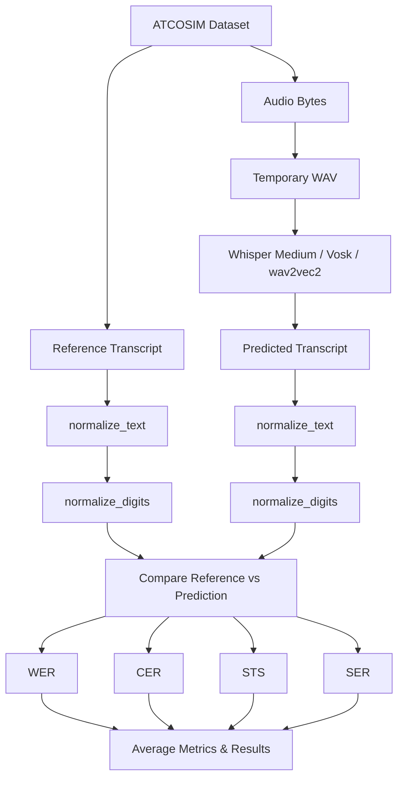

# STT-model-evaluation-in-ATC

This project provides a reproducible pipeline that evaluates Automatic Speech Recognition(ASR) models on Air Traffic Control(ATC) audio. The pipeline evaluates the accuracy of the multiple models using: WER, CER, STS, SER.
To understand how different ASR models behave, three major model families were selected: OpenAI Whisper, Vosk(ALpha Cephei), Wav2vec(meta/facebook).

Whisper:
I started with the base model before upgrading to Whisper medium due to:
-Higher accuracy
-Better handling of noisy data
-Improved digit recognition
Whisper Medium is slower than Base. Whisper is the strongest of the three models in this domain.

Vosk:
For Vosk, I selected the standard en‑us‑0.22 model, after trying to go with a larger model, which is a middle‑sized model in the Vosk family.
Reasons:
-The “large” Vosk models required significantly more storage
-The standard model is lightweight and CPU‑friendly
-It provides a good baseline for traditional Kaldi-style ASR
Vosk performs reasonably well on telephony-like audio but struggles with clipped syllables and some call signs.

Wav2vec:
For wav2vec2, I used the base 960h model, which is a pre trained model, trained on 960 hours of data. It also specializes in unlabled data(data that doesn't have a corresponding text labels).
Pros:
-Fast inference
-Good baseline for CTC-style ASR
Cons:
-Wav2vec2-base-960h is not domain-trained, and it performs poorly on ATC audio:
-Highly inaccurate
-Worst WER/CER of the three models
-Its speed is excellent, but accuracy is the lowest

I replaced wav2vec2 960h with wav2vec2 large 960h-lv60-self, which improved performance across all evaluation metrics. Word Error Rate decreased from 0.754 to 0.585, while Sentence Transformer Similarity increased from 0.428 to 0.602.

Model Update: The project initially evaluated facebook/wav2vec2-base-960h. It was later replaced with facebook/wav2vec2-large-960h-lv60-self, which consistently achieved better performance across WER, CER, STS, and SER.

Data:
The data comes from huggingface. Specifically called atcosim_corpus by Jzuluaga.
(https://huggingface.co/datasets/Jzuluaga/atcosim_corpus#data-fields)
The data uses real ATC simulation audio. It also carries ten hours of speech data. All clips are english spoken pronouced by ten non native speakers. It also includes transcriptions and segment durations.

Language detection:
This evalutions method was explored but later omitted because all ATCOSIM contains only english and spoken by non native speakers.

| Model                             |     WER ↓ |     CER ↓ |     STS ↑ |     SER ↓ |
| --------------------------------- | --------: | --------: | --------: | --------: |
| **Whisper Medium**                | **0.453** | **0.278** | **0.663** | **0.320** |
| **Vosk**                          | **0.526** | **0.294** | **0.638** | **0.347** |
| **wav2vec2-large-960h-lv60-self** | **0.585** | **0.297** | **0.602** | **0.362** |
| **wav2vec2-base-960h**            | **0.754** | **0.363** | **0.428** | **0.522** |

## Pipeline

The evaluation pipeline downloads speech samples from the ATCOSIM corpus, extracts each audio recording, and transcribes it using various models. Both the reference transcript and predictions are normalized using text normalization and ATC-specific digit normalization before comparison. The normalized transcripts are evaluated using Word Error Rate (WER), Character Error Rate (CER), Semantic Similarity (STS), and Semantic Error Rate (SER). Metrics are averaged across all evaluated samples to measure overall transcription performance.

